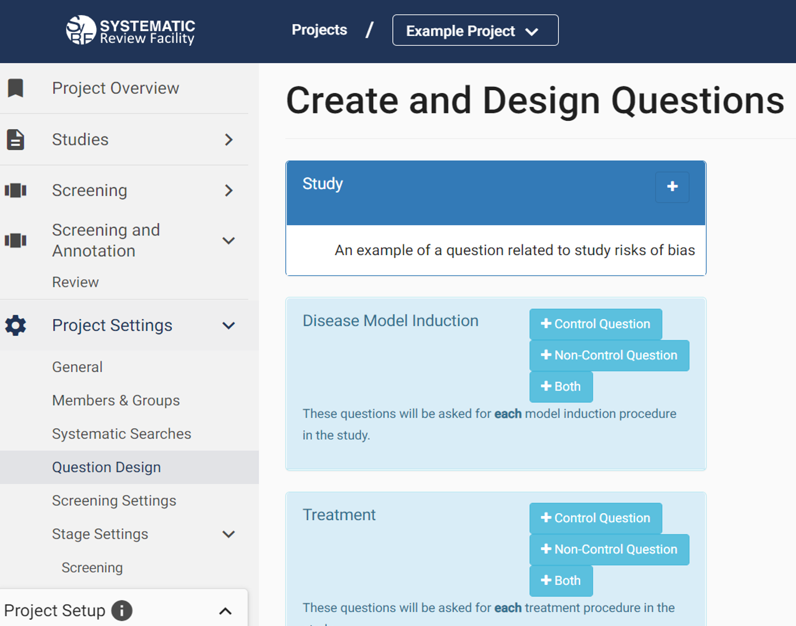
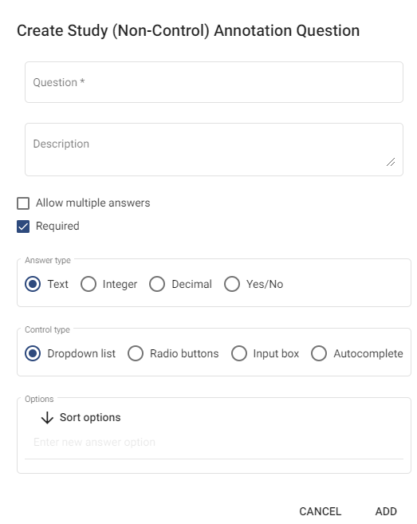

# Annotation Questions

## Creating Annotation Questions
In your systematic review protocol, you will have specified certain information you want to extract from each of your studies, such as 'Were animals randomised to experimental groups?' or 'What concentration of drug treatment was used?'. In SyRF you can annotate your studies with this information using annotation questions.

To design annotation questions for a stage of your project, go to 'Question Design' under 'Project Settings' on the left-hand navigation bar of your project.

### Question Editing
At present, questions can only be added or deleted. Individual questions cannot be edited or changed order. This is primarility due to our database structure and questions and an editing feature will be implemented in an upcoming release.

## Question Categories
Annotation questions are entered into the following categories depending on what information they ask about:

### Study Level Questions
Enter any question that is relevant to the overall study. 

e.g. Do the authors provide a study protocol that is available to you?
(Yes or No checkbox)

### Disease Model Induction Questions
When adding a question you will be required to select whether the question relates to Control animals, Non-control animals (model animals) or both. 

#### Control Question
Define questions that are specific to the Model control.

e.g. Do the control animals receive Sham surgery?
(Yes or No checkbox)

#### Non-Control Question
Define questions that are specific to the Model

e.g. What type of surgery was carried out to induce the model?
(Dropdown list with defined options)

#### Both
Define questions that are relevant to both Model control and Model animals

e.g. What anaesthetic was used for both the model and sham surgery?
(Dropdown list with defined options)

### Treatment Questions
When adding a question you will be required to select whether questions related to Control animals, Non-control animals (treatment group animals) or both.

#### Control Question
Define questions that are specific to the Treatment control

e.g. What is the vehicle given to the control animals? 
(Dropdown list with defined options)

#### Non-Control Question
Define questions that are specific to the Treatment group

e.g. Specify the dose of treatment drug given in mg/kg
(Decimal input box)

#### Both
Define questions that are relevant to both Treatment control and Treatment animals

e.g. What route of drug or vehicle administration is used in the experiment?
(Dropdown list with defined options)

### Outcome Assessment Questions
Define questions relevant to each outcome assessment procedure in the study.

e.g. What is the behavioural test used to measure outcome?
(Dropdown list with defined options)

### Cohort Level Questions
Define questions relevant to each cohort (experimental group) in the study. 

e.g. What is the sex of the animals included in the cohort?
(Dropdown list with options males, females, both, unknown)

**_I have cohorts with comorbidities and I'm not clear on how to differentiate between them._** 
[Check out the FAQ](https://syrf.org.uk/faq)

### Experiment Questions
Define questions relevant to each experiment in the study

e.g. Was there a habituation period?
(Yes or No checkbox)

## Creating a New Question
To add a question, simply click the '+' button next to the category you want to design a question in.

When adding a question, you can enter the following details:

1. The name of your question
2. A description of the question, which will be displayed alongside your question in SyRF
3. Whether the question accepts only a single answer or multiple answers
4. Whether the question is optional or required
5. The type of answer the question accepts (e.g. text, integers, decimals)
6. The question type (e.g. dropdown list, checkbox)

### Question Types
There are 6 question types in SyRF:

* Dropdown lists
* Autocomplete lists
* Radio buttons
* Checklists
* Check boxes
* Input boxes

We recommend that when using checklists or check boxes, you set the default checkbox status to 'indeterminate'.

### Allowing Multiple Answers
If you choose to allow multiple answers, you will be asked if you want these to be split into separate annotations. This refers to how the data will be presented in your output data file.

Choosing to split multiple answers into separate annotations means that, in your output file, the multiple answers will be separated into different rows. Choosing not to split into separate annotations, means that they will appear in the same row, separated by a semi-colon. 

If you have nested questions, it may be best to choose to split your answers into separate annotations so that the nesting displays properly in your output file. For example, in an 'Outcome Assessment' category question asking 'What behavioural tests are used?', we would allow multiple answers and may choose to split into separate annotations' as this allows us to ask further related questions to the specific behavioural test.

### Nesting Questions and Conditional Questions
Questions may be nested to allow for hierarchy of conditional information entry (i.e. questions can become active, depending on answers to previous questions). 

For each question you can choose to add related questions, if you want to get answers to additional questions, which are conditional on the answerto the previous question.

e.g. “What type of model is used?”
(Drop down list with option of: Pharmacological or Surgical)

We could then add a related question by selecting “Add Related”, and in the form "conditionally display based on parent question".

e.g. “What is the drug given?”
(Drop down list with options of different drugs)

You could then ask further related questions, by clicking on this question and selecting ‘Add Related’ and asking for each drug selected: “What is the dose and route of delivery?” If Surgical is selected then we may ask the related questions: “What was the anaesthetic used?” or “What was the site of lesion?”.

These questions will nest under the previous question.

## Adding Questions to Stages
Once you have designed your questions, to allow them to be presented to reviewers, you need to add them to your annotation stage by going to 'Stage Settings' then the name of the stage of want to add your questions to and selecting the questions you want to add to the stage.

