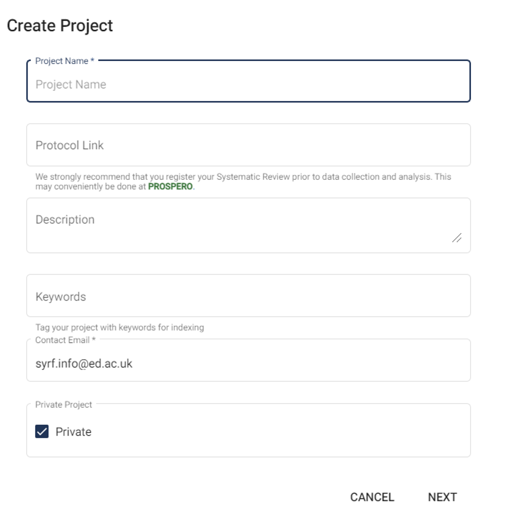
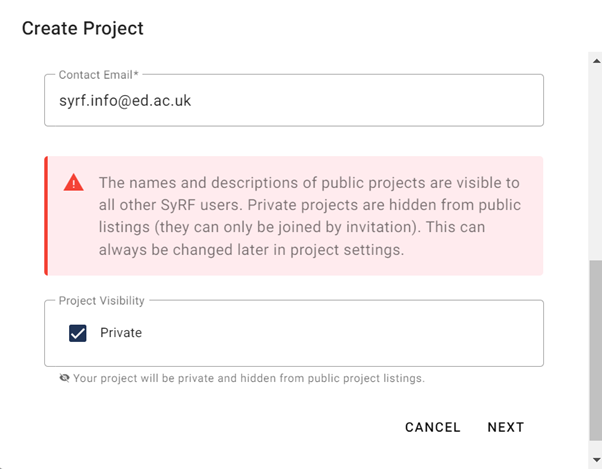

# Create a New Project

 

<!---Link to youtube help video:--->

    <iframe src="https://www.youtube.com/embed/m_VuroUdvYw?list=PLT9yacSnQZW85roKzVqoC11OiXm9pob-4" 
            title="" 
            frameborder="0" 
            allow="accelerometer; autoplay; clipboard-write; encrypted-media; gyroscope; picture-in-picture; web-share" 
            allowfullscreen>
    </iframe>

 

You can create new projects via the Projects tab. Enter your project details in the pop-up form that appears.

As part of project creation, you will be asked to specify the inclusion/exclusion criteria for your project. These should be pre-specified in your protocol.

Once you have created your project, you can keep track of your project progress through the Project Details Page on the right-hand side of your screen.

You will automatically be assigned a Project Administrator role in any project that you create.

## Projects with Multiple Screening Criteria

Currently, you can only have one set of inclusion/exclusion critiera per SyRF project. If you wish to have multiple screening stages in your systematic review, for instance title and abstract screening followed by full-text screening, you can do this by exporting your included studies from SyRF following your first screening stage and uploading them to a new SyRF project to complete your second screening stage.

## Public and Private Projects 

When you create a SyRF project you can make it public or private. 

The names and descriptions of public projects are visible to all other SyRF users. Private projects are hidden from public project listings. Project visibility can be adjusted later in [Project Settings](../nav-project-settings.html) by going to *Project Settings> General> Visibility* and enable or disable ‘Public Project’. 

<!--- [Contact us](mailto:helpdesk@syrf.org.uk) for a link to a Shiny App which will allow you to export your data. --->

