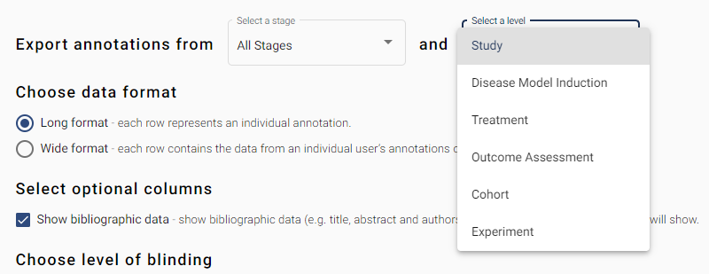

# Annotation Data

In this section, select which stage you want to export annotations for. 
 
## Select a stage 

This dropdown menu allows you to select which stages of your review you would like to download data for. By default, all stages are selected. Click on the dropdown menu to see a list of the stages in your project. You can select/deselect specific stages by ticking/unticking the checkboxes next to each stage.  

 
## Select a level 

This dropdown menu allows you to select which level of annotations you would like to download data for. 

Your options are:  

    Study 

    Disease Model Induction  

    Treatment  

    Outcome Assessment  

    Cohort 

    Experiment  

### Choose data format 

In this section, select which format you would like your data in. This refers to long or wide format.  

You have two options:  

1. Long format – Mostly useful if you plan to programmatically interact with your data (e.g. using R).  In long format, data are presented in a normalised format where each row represents an individual annotation. N.B. If you have many annotation questions in your project, this will result in a large number of rows.   

2. Wide format – Mostly useful to gain a visual overview of your data (e.g. in excel). In the wide format, each row contains the data from an individual user’s annotation session.  

Split annotations 

When you have all stages selected, and you choose wide format, an additional checkbox appears called “Split annotations by stage”. Clicking this option will alter the format of the data output and annotation sessions from different stages will be shown on separate rows.  

## Select optional columns  

This tick box allows you to control whether bibliographic data is included in the data downloaded. The default option is to include bibliographic data (e.g. title, abstract and authors). If deselected, only unique study ID will show. 

## Chooses level of blinding  

In this section, select whether you want to be aware of which reviewer made the screening decision or not. 

You have two options:  

1.  Show investigator name and unique ID – this option displays the full name and unique SyRF ID for each SyRF user that has made a screening decision on each article. This option means you will be not be blinded to screening decision.   

2. Show only investigator unique ID – this option ONLY displays the unique SyRF ID for each SyRF user that has made a screening decision on each article. This option means you will be partially blinded to who has made screening decisions for each article. It is possible to find out which unique SyRF ID belongs to which SyRF user at a later date.  

## Choose data to export  

In this section, select which studies you want to export. 

You have two options:  

1. All annotations – this will export annotations for all studies that are in this project.  

2. Only annotations from completed study reviews – this will export annotations only for studies that have been marked as completed by reviewers. 
