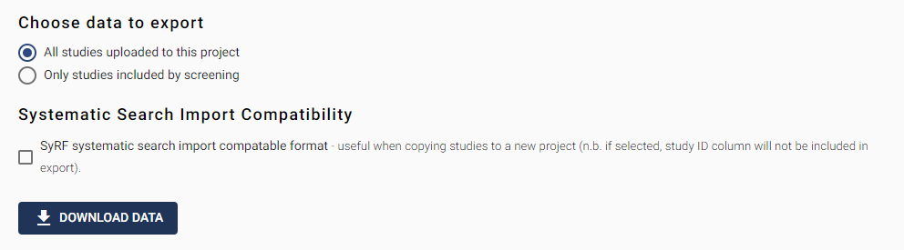

# Bibliographic Data

This section allows you to export the bibliographic information about the studies in your SyRF project. Bibliographic information refers to the following fields: Unique SyRF StudyId, Title, Authors, Publication Name (Journal title), Alternate Name, Abstract, Url, Author Address, Year,DOI, ReferenceType, Keywords, PDFRelativePath (where the PDF can be found), DateTimeCreated, Systematic Search Id, Systematic Search Name.  

## Choose data to export  

In this section, select which studies you want to export. 

You have two options:  

1. All studies uploaded to this project – this will export all studies that are in this project, regardless of status.  

2. Only studies included by screening – this will export only studies that have a reconciled decision of “Included” or relevant to the research question.  
 
Clicking the “Download data” button will download your data to your local computer. Please note, this may take some time depending on the size of the file. Please do not navigate away from this page until the data file has been downloaded. The filename of the downloaded file will contain the data-type, the date of download, the Project ID, and the level of blinding. 

## Systematic Search Import Compatibility

This tick box allows you to control whether columns containing SyRF internal identification numbers are included. If ticked, study ID, Search ID, Search name, and Custom ID will be omitted, allowing the data to be directly imported into a new SyRF project.
