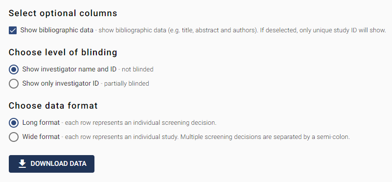

# Screening Data

This section allows you to export screening data for the studies in your SyRF project. 

## Select optional columns  

This tick box allows you to control whether bibliographic data is included in the data downloaded. The default option is to include bibliographic data (e.g. title, abstract and authors). If deselected, only unique study ID will show. 

## Chooses level of blinding  

In this section, select whether you want to be aware of which reviewer made the screening decision or not. 

You have two options:  

1.  Show investigator name and unique ID – this option displays the full name and unique SyRF ID for each SyRF user that has made a screening decision on each article. This option means you will be not be blinded to screening decision.   

2. Show only investigator unique ID – this option ONLY displays the unique SyRF ID for each SyRF user that has made a screening decision on each article. This option means you will be partially blinded to who has made screening decisions for each article. It is possible to find out which unique SyRF ID belongs to which SyRF user at a later date.  
 
## Choose data format 

In this section, select which format you would like your data in. This refers to long or wide format.  

You have two options:  

1.  Long format – Mostly useful if you plan to programmatically interact with your data (e.g. using R).  In long format, data are presented in a normalised format where each row represents an individual screening event.  

2.  Wide format – Mostly useful to gain a visual overview of your data (e.g. in excel). In the wide format, each row represents information for a unique study in your SyRF project, with multiple screening decisions separated with a semi-colon. 
