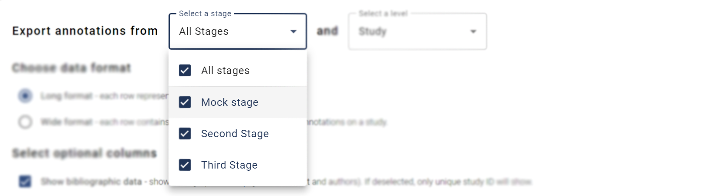
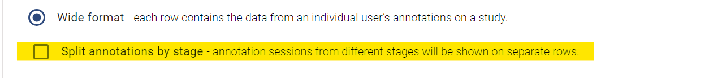
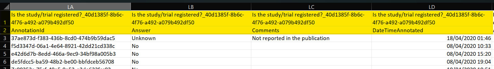
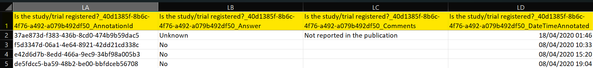
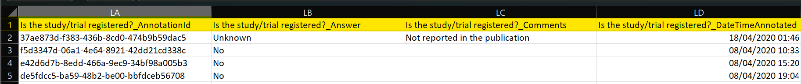

# Annotation Data

The **Export Annotation Data** page allows you to download an export of your project's annotation data in spreadsheet format.

## Data Dictionaries

For detailed descriptions of the columns contained in the export (and example exports) refer to the data dictionaries below.

[Annotation (Long Format) Data Dictionary](data-dictionary/annotation-long.html)

[Annotation (Wide Format) Data Dictionary](data-dictionary/annotation-wide.html)

---

## Export Configuration

### Select a stage

This dropdown menu allows you to select which stages of your review you would like to download data for. By default, all stages are selected. Click on the dropdown menu to see a list of the stages in your project. You can select/deselect specific stages by ticking/unticking the checkboxes next to each stage.

### Select a level

This dropdown menu allows you to select which level of annotations you would like to download data for.

### Choose data format

Select which of the following formats you would like your data in.

1. **Long format** – Mostly useful if you plan to programmatically interact with your data (e.g. using R). In long format, data are presented in a normalised format where each row represents an individual annotation. N.B. If you have many annotation questions in your project, this will result in a large number of rows.
2. **Wide format** – Mostly useful to gain a visual overview of your data (e.g. in excel). In the wide format, each row contains the data from an individual user’s annotations. Unless the **Split annotations by stage** option is selected.

#### Split annotations by stage (only available in wide format)

When in wide format, an additional checkbox appears called “**Split annotations by stage**”. Selecting this option will alter the format of the data output such that annotation sessions from different stages will be shown on separate rows.

#### Choose wide format header type (only available in wide format)

Select the style of headers for the annotation question columns in the data export

1. **Two header rows with question** - An extra header row is added to show the question text and ID.
   
2. **Single header row with question ID** - Only one header row is shown with question text and ID as prefix.
   
3. **Single header row simple** - Only one header row is shown. The question ID is omitted.
   

### Select optional columns

This checkbox allows you to control whether [bibliographic data columns](data-dictionary/bibliographic.html) are included in the downloaded data. The default option is to include bibliographic data (e.g. title, abstract and authors). If deselected, only the unique study ID will be included.

### Choose level of blinding

On this page, select whether you want to be aware of which reviewer made the screening decision or not.

1. **Show investigator name and unique ID** – displays the full name and unique SyRF ID for each SyRF user that has made a screening decision on each article. This option means you will be not be blinded to screening decision.
2. **Show only investigator unique ID** – ONLY displays the unique SyRF ID for each SyRF user that has made a screening decision on each article. This option means you will be partially blinded to who has made screening decisions for each article. It is possible to find out which unique SyRF ID belongs to which SyRF user at a later date.

### Choose data to export

Select which studies you want to export.

1. **All annotations** – export annotations for all studies that are in this project.

2. **Only annotations from completed study reviews** – export annotations only for studies that have been marked as completed by reviewers.
