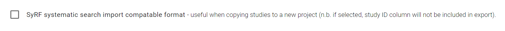

# Bibliographic Data

The **Export Bibliographic Data** page enables you to download a spreadsheet export of the bibliographic information for the studies in your SyRF project.

Bibliographic information refers to information obtained from your reference source that was uploaded to SyRF with the systematic search upload.

## Data Dictionary

For detailed descriptions of the columns contained in the export (and an example export) refer to the data dictionary below.

[Bibliographic Data Dictionary](data-dictionary/bibliographic.html)

---

## Export Configuration

### Choose data to export

Select which studies you want to export.

1. **All studies uploaded to this project** – this will export all studies that are in this project, regardless of status.

2. **Only studies included by screening** – this will export only studies that have a reconciled decision of “Included” or relevant to the research question.

### Systematic search import compatibility

This checkbox allows you to control whether columns containing SyRF internal identification numbers are included. If ticked, study ID, Search ID, Search name, and Custom ID will be omitted, allowing the data to be directly imported into a new SyRF project.
