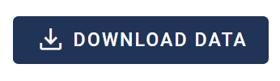

# Exporting Data

Once your annotations are complete, you will need to export them for analysis.

SyRF provides project administrators the possibility to export their studies and associated data from their project. This is available in the “Data Export” tab in the Navigation Bar.

Clicking the “**DOWNLOAD DATA**” button will download your data to your local device.

Please note, this may take some time depending on the size of the file. Please do not navigate away from this page until the data file has been downloaded.

The filename of the downloaded file will contain the data-type, the date of download, the Project ID, and the level of blinding.
