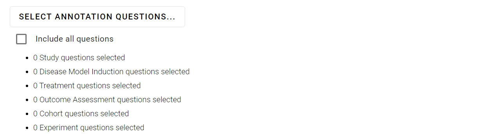

# Quantitative Data

The **Export Quantitative Data** page enables you to download your quantitative data in a format that is suitable for analysis in statistical software such as R or SPSS.

On this page, select the additional information you would like to include with the export of your quantitative (time point) data.

[Quantitative Data Dictionary](data-dictionary/quantitative.html)

## Select annotation questions to include in export

Allows you to select any combination of corresponding annotations to include with each time point.

## Select optional columns

This checkbox allows you to control whether [bibliographic data columns](data-dictionary/bibliographic.html) are included in the downloaded data. The default option is to include bibliographic data (e.g. title, abstract and authors). If deselected, only the unique study ID will be included.

## Choose level of blinding

On this page, select whether you want to be aware of which reviewer made the screening decision or not.

1. **Show investigator name and unique ID** – displays the full name and unique SyRF ID for each SyRF user that has made a screening decision on each article. This option means you will be not be blinded to screening decision.

2. **Show only investigator unique ID** – ONLY displays the unique SyRF ID for each SyRF user that has made a screening decision on each article. This option means you will be partially blinded to who has made screening decisions for each article. It is possible to find out which unique SyRF ID belongs to which SyRF user at a later date.

## Choose data to export

Select which studies you want to export.

1. **All annotations** – export annotations for all studies that are in this project.

2. **Only annotations from completed study reviews** – export annotations only for studies that have been marked as completed by reviewers.
