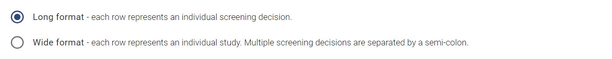
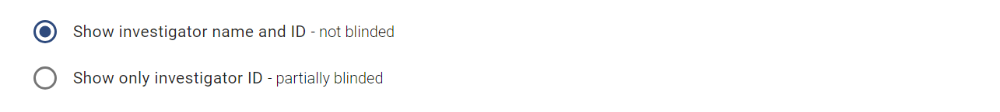

# Screening Data

The **Export Screening Data** page allows you to download an export of your project's screening data in spreadsheet format.

## Data Dictionary

For the detailed descriptions of the columns contained in the export (and an example export) refer to the data dictionary below.

[Screening Data Dictionary](data-dictionary/screening.html)

---

## Export Configuration

### Choose data format

Select which of the following formats you would like your data in.

1. **Long format** – Mostly useful if you plan to programmatically interact with your data (e.g. using R). In long format, data are presented in a normalised format where each row represents an individual screening event.

2. **Wide format** – Mostly useful to gain a visual overview of your data (e.g. in excel). In the wide format, each row represents information for a unique study in your SyRF project, with multiple screening decisions separated with a semi-colon.

### Select optional columns

This checkbox allows you to control whether [bibliographic data columns](data-dictionary/bibliographic.html) are included in the downloaded data. The default option is to include bibliographic data (e.g. title, abstract and authors). If deselected, only the unique study ID will be included.

### Choose level of blinding

In this section, select whether you want to be aware of which reviewer made the screening decision or not.

1. **Show investigator name and unique ID** – displays the full name and unique SyRF ID for each SyRF user that has made a screening decision on each article. This option means you will be not be blinded to screening decision.

2. **Show only investigator unique ID** – ONLY displays the unique SyRF ID for each SyRF user that has made a screening decision on each article. This option means you will be partially blinded to who has made screening decisions for each article. It is possible to find out which unique SyRF ID belongs to which SyRF user at a later date.
