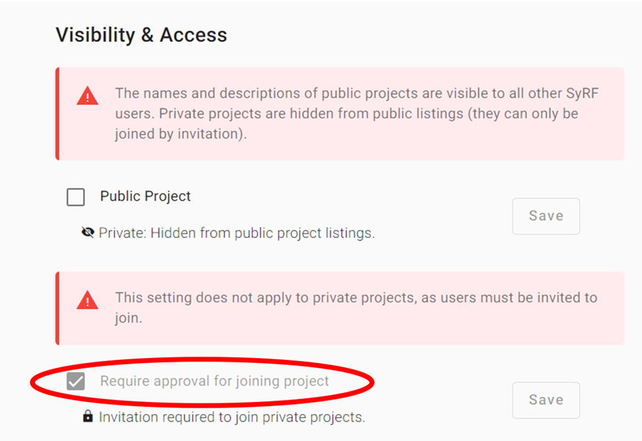

# Project Settings
Only Project Administators are able to edit project settings.

## General Settings
In the general project settings, Project Administrators can edit:

* Project name
* Project description
* Project visibility & access
* Contact email
* Protocol Url
* Keywords

### Visibility & Access
**Private projects** are joined by invitation only. Whereas **public projects** can be configured to require approval by a project Admin. 

By default projects will require approval from a project admin to join the project. Project access requirements can be changed by going to *Project Settings > General > Visibility & Access* and enabling/disabling ‘Require approval for joining project’. 

Disabling approval for public projects will allow any user to join your project and start reviewing without explicit approval, which is not recommended for sensitive projects.

### Deleting Projects
Projects can be deleted from the general settings. Please know that data from deleted projects cannot be recovered.

## Memberships

Only Administrators in a project can change a project member’s Project Group.
Note that in SyRF projects there are two project groups: Reviewers and Administrators. [Click here to read more about User Roles.](../roles.html)

## Question Design
Project Administrators can add and delete annotation questions in their project on this page. These questions can be then assigned to annotation stages. For more information, go to [Annotation]({{ site.baseurl }}).

## Stage Settings
In the stage settings, Project Administrators can add and edit stages.

You can decide which elements to add to your stage, e.g. screening, annotation and/or data extraction. If you choose both screening and annotation, you will be asked to choose how to combine these tasks. Specifically, the options are:
	- All studies require screening, but annotation is optional
	- All studies require annotation, but screening is optional
	- All studies require both screening and annotation

### Annotation Question Selection
Project Administators can select which questions they have created in the Question Design settings page to add to each stage. Click the 'Edit project questions' button to return to the question design page.

