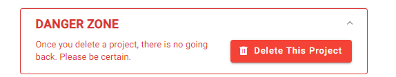

# Project Settings
Only Project Administrators are able to edit Project Settings (accessed via the side navigation bar).

## General 
In the general project settings, Project Administrators can edit:

* Project name
* Project description
* Project visibility & access
* Contact email
* Protocol Url
* Keywords

### Visibility & Access
**Private projects** are joined by invitation only. Whereas **public projects** can be configured to require approval by a project admin. 

By default projects will require approval from a project admin to join the project. Project access requirements can be changed by going to *Project Settings > General > Visibility & Access* and enabling/disabling ‘Require approval for joining project’. 

Disabling approval for public projects will allow any user to join your project and start reviewing without explicit approval, which is not recommended for sensitive projects.

## Advanced Project Settings

### Changing Ownership 
Under 'Advanced Settings' project owners can change project ownership. 

Warning: Be aware that by changing the project owner, you will lose the ownership of the project. The new owner will be able to delete the project without approval.

### Delete a Project
To delete a project, scroll down to the bottom of *Project Settings* and open up the 'Danger Zone' section. Then click the 'Delete This Project' button. Please be aware that data from deleted projects cannot be recovered, this action is irreversible. 

## Membership

Note that in SyRF projects there are two project groups: Reviewers and Administrators. [Click here to read more about User Roles.](../members-groups.html) Only project administrators can change a project member’s project group. 

## Question Design
Project Administrators can add and delete annotation questions in their project on this page. These questions can be then assigned to annotation stages. For more information, go to [Annotation]({{ site.baseurl }}).

 