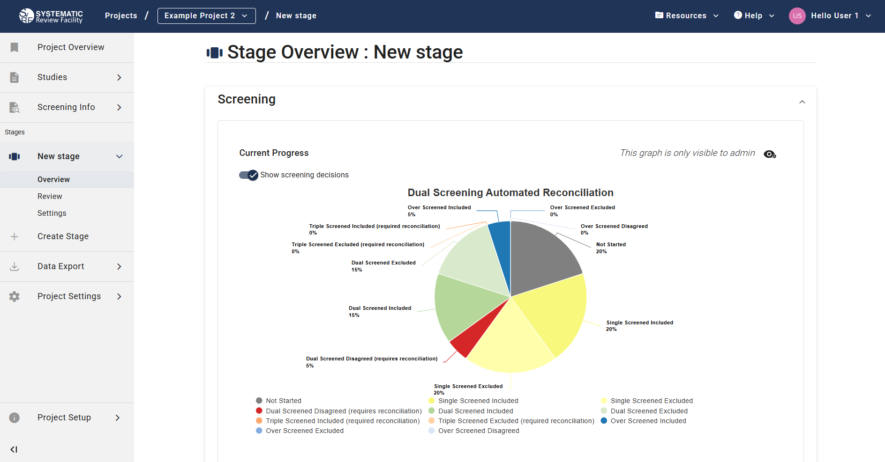
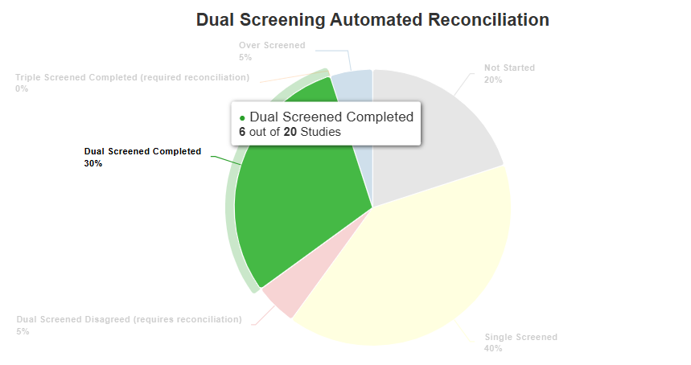

# Project overview 

You can monitor the progress of the project, including the level of completion of the screening and annotation stages, in the Overview tab, which is found under the tab for each stage in the left-side menu.  

## Screening stage 

### Dual screening 

Two versions of the chart detailing the dual screening progress are available to view: 

- When “Show screening decisions” is turned off, the chart displays the proportion of studies not screened, screened by 1 reviewer, screened by 2 reviewers who agreed, screened by 2 reviewers who disagreed (requiring reconciliation), screened by 3 reviewers (reconciled), and overscreened studies (screened by more than three users).  

- When “Show screening decisions” is turned on, the chart provides additional information for studies that have undergone screening, including details on whether they have been excluded or included, as well as the proportion of overscreened studies for which the reviewers disagreed. 

You can hover over each pie chart slice in both views to get more detailed information on the exact number of studies in each section.

     

#### Screening Leaderboard

Further down below, you can also see the "Screening Leaderboard" table, which provides more detailed information on each user's screening activity.

### Single screening 

Similar information is available when single screening is selected instead of dual screening. The simplified version of the chart displays the proportion of studies not screened, single screened and overscreened, whereas the detailed version provides additional information on screening decision. 

The corresponding categories of the two charts are summarised below: 

<table border="1" cellspacing="0" cellpadding="5">
  <tr>
    <th colspan="2">Dual screening</th>
    <th rowspan="2">Single screening</th>
  </tr>
  <tr>
    <td>“Show screening decisions” off</td>
    <td>“Show screening decisions” on</td>
  </tr>
  <tr>
    <td>Not started</td>
    <td>Not started</td>
    <td>Not started</td>
  </tr>
  <tr>
    <td rowspan="2">Single screened</td>
    <td>Single screened included</td>
    <td rowspan="3">Single screened</td>
  </tr>
  <tr>
    <td>Single screened excluded</td>
  </tr>
  <tr>
    <td rowspan="2">Dual screened completed</td>
    <td>Dual screened included</td>
  </tr>
  <tr>
    <td>Dual screened excluded</td>
    <td rowspan="2">Single screened excluded</td>
  </tr>
  <tr>
    <td colspan="2">Dual screened disagreed (requires reconciliation)</td>
  </tr>
  <tr>
    <td colspan="2">Triple screened completed (required reconciliation)</td>
    <td rowspan="2">Triple screened included (required reconciliation)</td>
  </tr>
  <tr>
    <td colspan="2">Triple screened excluded (required reconciliation)</td>
  </tr>
  <tr>
    <td rowspan="4">Overscreened</td>
    <td>Overscreened included</td>
    <td rowspan="4">Overscreened</td>
  </tr>
  <tr>
    <td>Overscreened excluded</td>
    <td>Overscreened included</td>
  </tr>
  <tr>
    <td>Overscreened disagreed</td>
    <td>Overscreened excluded</td>
  </tr>
  <tr>
    <td></td>
    <td>Overscreened disagreed</td>
  </tr>
</table>

Or

# Annotation stage 

Two versions of the chart detailing the annotation progress are available to view:  

- When “Show all” is turned off, a simplified version of the chart displays the proportion of studies with 0, 1 or 2 fully completed reviews, as well as overannotated studies.  

- When “Show all” is turned on, the more comprehensive version of the chart displays the proportion of studies with 0, 1, 2 or ≥ 3 complete (green circle) or incomplete (yellow circle) sessions. In this chart, a complete session is equivalent to a fully completed review, whereas an incomplete session refers to a review in progress (a review started and saved but not completed).

 

You can hover over each pie chart slice in both views to get more detailed information on the exact number of studies in each section. When the "Show all" is turned on, you can also see the number of incomplete and/or incomplete sessions for each section.

    

Further down below, you can also see the "Annotation Leaderboard" table, which provides more detailed information on each user's annotation activity, in the same way as in the Screening section above.

Studies are considered to have no completed reviews if they have 0 complete sessions or up to 2 incomplete sessions. Studies are considered to have 1 completed review if they have 1 complete session ± 1 incomplete session. Studies are considered to have 2 completed reviews if they have 2 complete sessions. Finally, studies are considered overannotated if they have ≥ 3 complete/incomplete sessions. This is summarised in the table below:  

| “Show all” off         | “Show all” on                                      |
|------------------------|---------------------------------------------------|
| No completed review   | No complete or incomplete session                 |
|                        | 1 incomplete and 0 complete sessions              |
|                        | 2 incomplete and 0 complete sessions              |
| 1 completed review    | 1 complete and 0 incomplete sessions              |
|                        | 1 complete and 1 incomplete sessions              |
| 2 completed reviews   | 2 complete and 0 incomplete sessions              |
| Over annotated        | ≥ 3 complete and 0 incomplete sessions            |
|                        | ≥ 2 complete and ≥ 1 incomplete sessions          |
|                        | ≥ 1 complete and ≥ 2 incomplete sessions          |
|                        | ≥ 3 incomplete and 0 complete sessions            |

OR

This feature is optimised for stages where the setting(LINK) "Required Annotators per Study" is set to 2 (i.e., studies with 3 or more annotators count as overannotated)
ADD LINK TO THE SETTING of the userguide