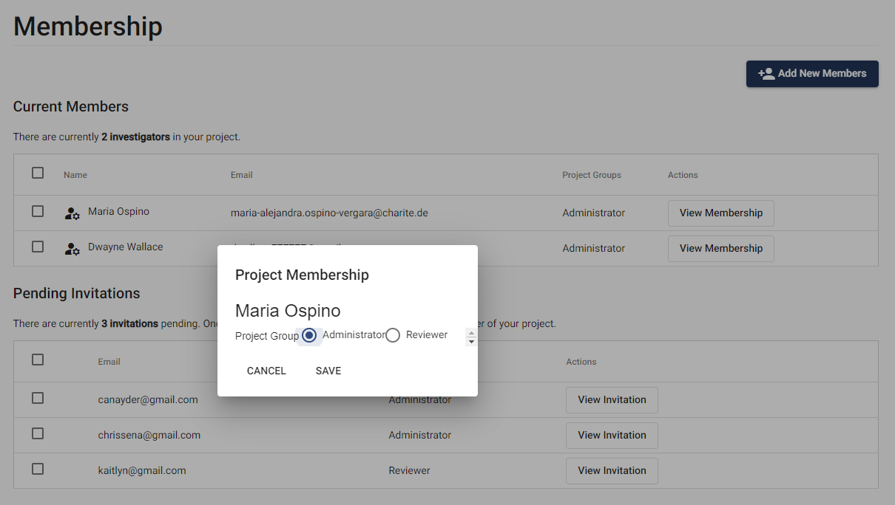

# SyRF User Roles

There are two user roles in SyRF: 

1. Project Administrator (admin)
2. Reviewer

These roles are project specific - you may be a Project Administrator in some of your projects and a Reviewer in others.

You will automatically be assigned a Project Administrator role in any project that you create. Project Administrators can edit projects. 

SyRF users that request to join a project will automatically be assigned a Reviewer role. Reviewers can screen or annotate studies in the project.

## Changing a User Role
When users join a project, they will automatically be assigned the Reviewer role.

Only Project Administrators can change user roles.  In the list of members in your project, you can assign other members to be Project Administrators by selecting the Administrator check box.

If you are assigned a Reviewer role and think you should be a Project Administrator instead, please contact one of the other Project Administrators on the project to change this for you.
