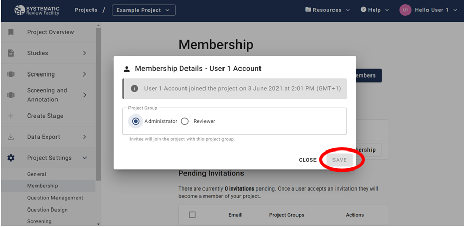
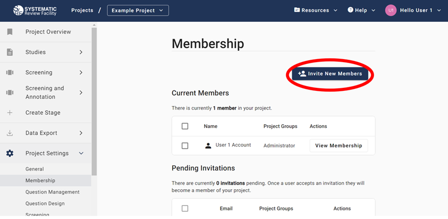
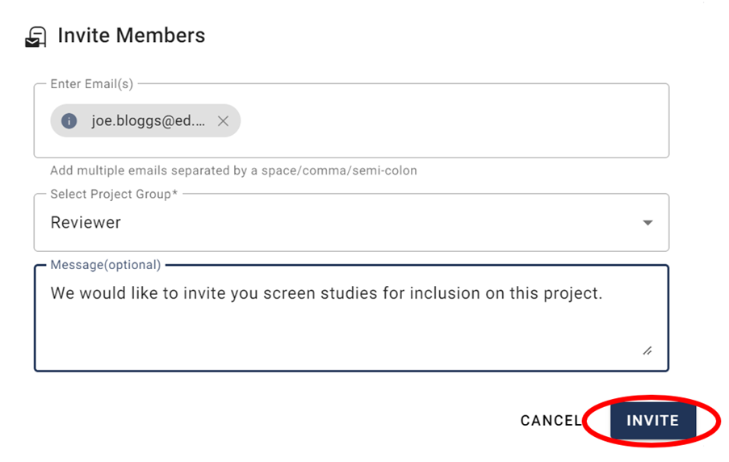
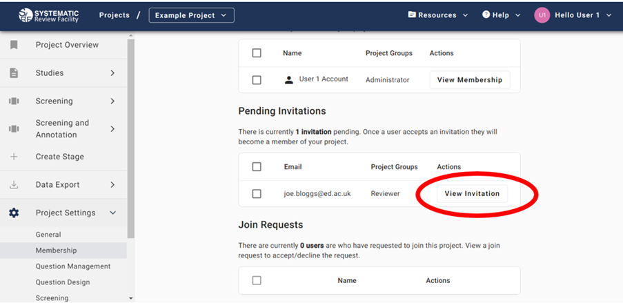
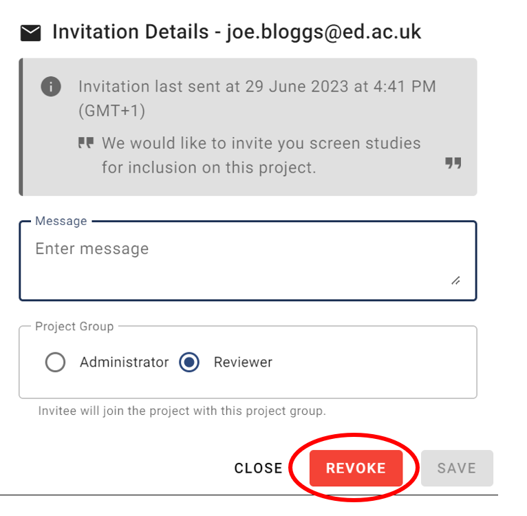
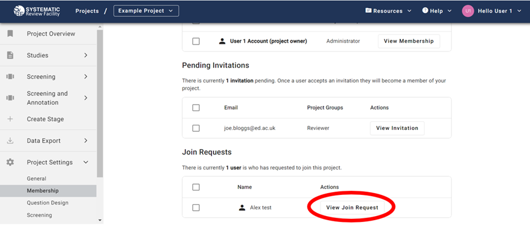
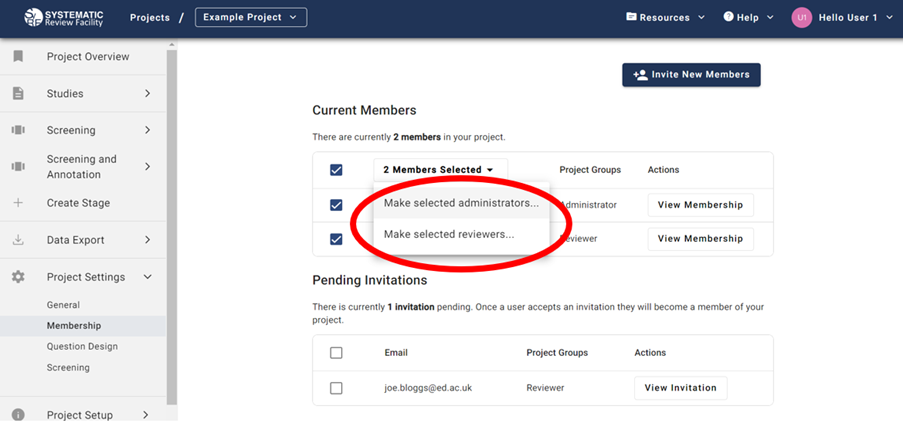
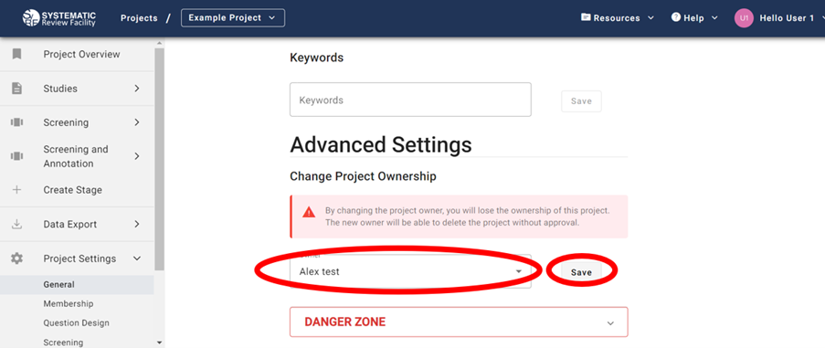

# SyRF Project Groups

There are two project groups in SyRF:

## Reviewers

Reviewers can: 
* screen studies for inclusion
* annotate studies

## Administrators (admin)

In addition to the ability Reviewers have, Administrators can also:
* edit project settings
* approve or reject join requests
* invite other to become project members
* upload studies 
* edit annotation questions
* export data 

These roles are project specific - you may be a Administrator in some of your projects and a Reviewer in others.

You will automatically be assigned a Administrator role in any project that you create. 

## Changing a User Role
<!---When users join a project, they will automatically be assigned the Reviewer role.--->

Only Project Administrators can change user roles. There is a list of project members under *Project Settings > Membership*, where Project Administrators can change member roles.

 <!---In the list of members in your project, you can assign other members to be Project Administrators by selecting the Administrator check box. --->

 Under *Project Settings > Membership > Current Members* click 'View Membership' and you can assign the Project Group (Administrator or Reviewer). 

Once you have assigned a role click Save.

If you are assigned a Reviewer role and think you should be a Administrator instead, please contact an Administrator on the project to request the change. 

## Inviting New Members

Administrators can invite new reviewers by going to *Project Settings > Membership* and clicking 'Invite New Members' on the top righthand side. 

In the form, enter the email address/addresses of those you want to invite to your project, select whether you want these members to be a reviewer or administrator and optionally include a message in the invitation. Once complete, click ’Invite’.

The invitee will receive an email with instructions to join the project. Any invitations you have sent are listed under Pending Invitations until the invitee accepts or declines the request.

 <!--- Add image showing the list of pending invitations as it appears on the "Members & Groups" page --->

## Revoke a Pending Invitation

To view pending invitations go to *Project Settings > Membership* and scroll down to Pending Invitations section. Invitations can be revoked by clicking on ‘View Invitation’ and clicking ‘Revoke’.

## Accept or Decline Requests to Join Your Project

To view join requests submitted by users, go to *Project Settings > Membership* and scroll down the Join Requests table. You should click on ‘View Join Request’ to accept or decline the request.

## Updating Member Project Groups 

It is possible to change the roles of multiple users at the same time. Go to *Project settings > Membership* and in the Current Members table select the users that you want to change the roles of. Select these members by ticking the select box on the left hand side of the members’ name. A drop down list will then be visible where you can make all selected members administrators or reviewers.

Administrators are able to view project members (*Project Settings > Membership > Current Members*). The project owner is highlighted in bold and has the label (project owner) after their user name.

## Changing Your Role as Project Owner 

As project owner, it is possible to change your own role to Reviewer and you will retain your role as project owner. As project owner, it is possible to change your role back to Administrator.

### Changing the Project Owner 

To assign another project member as project owner you will need to be an Administrator. Go to Project Settings and Scroll down to Advanced settings. **By changing the project owner, you will lose the ownership of the project. The new owner will be able to delete the project without approval.** 
Select the new owner from the drop down list and click save.

** Only the owner of the project can transfer ownership to another member.** 