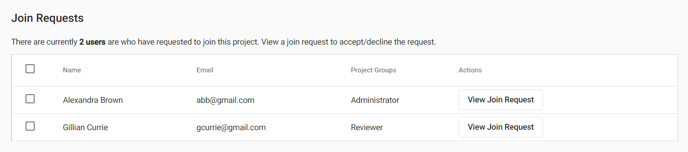
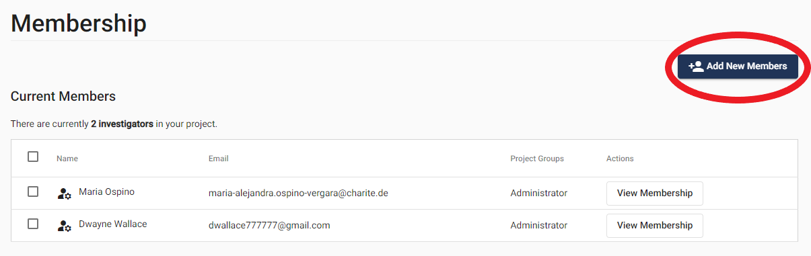
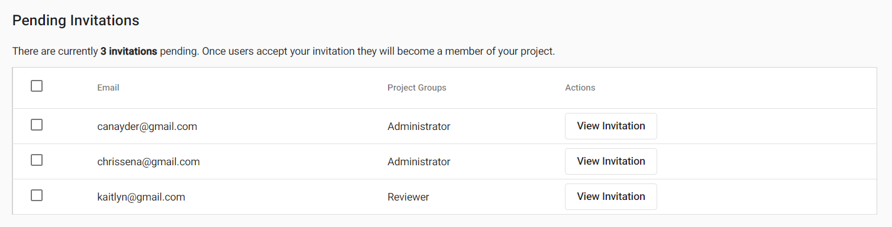

# SyRF User Roles

There are two user roles in SyRF:

1. Project Administrator (admin)
2. Reviewer

These roles are project specific - you may be a Project Administrator in some of your projects and a Reviewer in others.

You will automatically be assigned a Project Administrator role in any project that you create. Project Administrators can edit projects. 

SyRF users that request to join a public project will automatically be assigned a Reviewer role. Reviewers can screen or annotate studies. Users that request to join private projects will need to be approved by a Project Administrator prior to being able to screen or annotate studies. 

Project Administrators can view a list of Join Requests under Project Settings -> Members & Groups, where they can approve or reject requests. 

 <!--- Add image showing the list of join requests as it appears on the "Members & Groups" page --->

## Changing a User Role
<!---When users join a project, they will automatically be assigned the Reviewer role.--->

Only Project Administrators can change user roles. There is a list of project members under Project Settings -> Members & Groups, where Project Administrators can change member roles.

 <!---In the list of members in your project, you can assign other members to be Project Administrators by selecting the Administrator check box. --->

If you are assigned a Reviewer role and think you should be a Project Administrator instead, please contact one of the other Project Administrators on the project to change this for you.

## Inviting New Reviewers

Administrators can invite new reviewers by going to Project Settings -> Members & Groups and clicking Add New Members on the top righthand side. The invitee will receive an email inviting them to participate as a reviewer. 

A list of pending invitations is visible to Project Administrators under Project Settings -> Members & Groups, where the status of previously sent invitations can be viewed and or revoked. 

 <!--- Add image showing the list of pending invitations as it appears on the "Members & Groups" page --->
