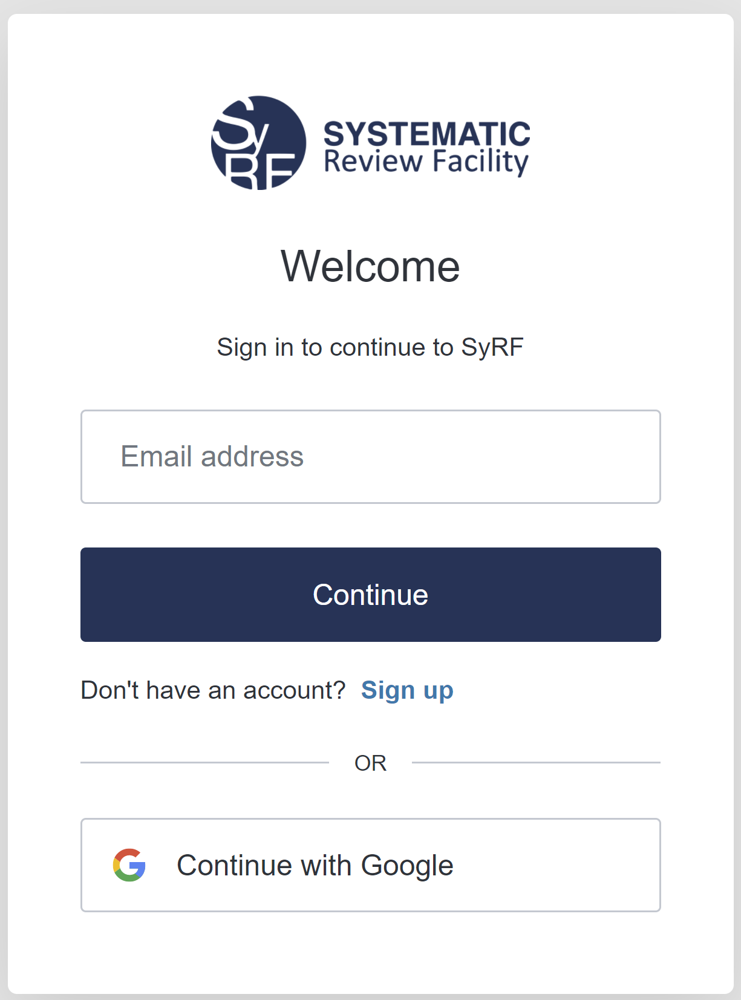
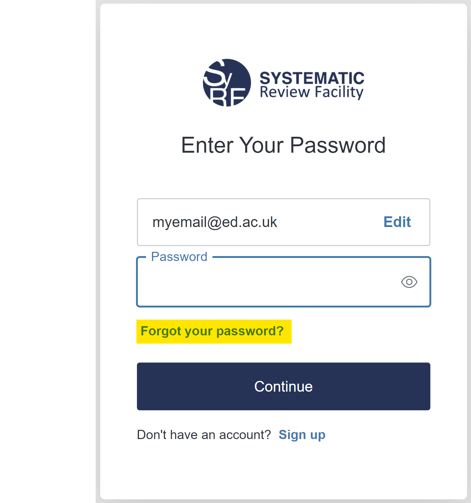

# Sign In System Upgrade - Important Changes

We have upgraded SyRF’s Sign In System. As part of this upgrade, you are required to set a new password. 

The sign in system will take you to a new welcome landing page:

When signing in to SyRF the application will take you to a new welcome landing page.

Here you can select whether you wish to sign in using either:

1. An email & password by entering your email address and pressing 'Continue'.

2. Sign in using a social sign-in. E.g. Google by pressing 'Continue with Google'.

## Users who sign in using an email & password

You will be required to reset your password. Your new password should contain:
* At least 8 characters
* At least 3 of the following: 
  - Lower case letters (a-z)
  - Upper case letters (A-Z)
  - Numbers (0-9)
  - Special characters (ex. !@~$%^&*)

On the ‘Enter your password’ page click on the ‘Forgot your password?’. This will send you an email with a link to reset your password. 

## Users who sign in with an external login e.g. Google

After your first time authenticating with your social sign-in (e.g. Google) you will be required to re-link your social sign-in to your SyRF account.   
 
Follow the instructions under ‘Existing SyRF account’ making sure you enter the email already  associated with your SyRF account. You will then 

If you have any problems, please let us know by contacting syrf.info@ed.ac.uk. 
