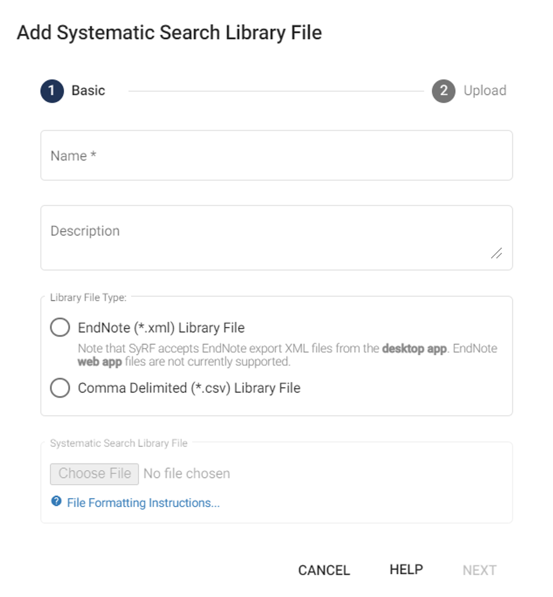

# Systematic Search Upload Instructions

 

<!---Link to youtube help video:--->

    <iframe src="https://www.youtube.com/embed/e6blmlaPrNA?list=PLT9yacSnQZW85roKzVqoC11OiXm9pob-4" 
            title="" 
            frameborder="0" 
            allow="accelerometer; autoplay; clipboard-write; encrypted-media; gyroscope; picture-in-picture; web-share" 
            allowfullscreen>
    </iframe>

 

## Deduplicating your Systematic Search
If you have searched for studies using multiple databases there will be duplicate studies in your systematic search. Currently SyRF does not support deduplication of studies, and this must be performed before your studies are uploaded to SyRF. You can deduplicate your studies automatically using the [ASySD deduplication tool](https://camarades.shinyapps.io/RDedup/).

## Uploading Files	
A Project Administrator can upload a systematic search to your project by selecting Systematic Searches from Project Settings and clicking "Upload New Systematic Search".
	
systematic searches can be uploaded as an:

* EndNote XML file
* Comma separated value (CSV) file

SyRF currently accepts EndNote **Desktop** XML files. EndNote Web XML files are not supported.

### Using EndNote (as XML)
*Without screening decisions (screening upload not currently supported)*

1. Import all references to be screened into EndNote 
2. Find the full text PDFs by highlighting all your references (`Ctrl`+`A`) and click References -> Find Full Text
3. Highlight (`Ctrl`+`A`) all references and click File -> Export (NB: if you do not highlight all references only the first reference on your list will be exported) 
4. Change the file type to XML 
5. Name and save your XML file, which is now ready to be uploaded to the SyRF screening database

#### Uploading From a Zotero Export
Please note that you cannot use the 'EndNote XML' export option in Zotero to upload an EndNote file to SyRF. If you are using Zotero to manage your study references, please export as a CSV file and follow the CSV upload instructions.

**_I am getting an error when uploading an EndNote XML file_** 
[Check out the FAQ](https://syrf.org.uk/faq)

### Spreadsheet (\*.csv supported)
*Optionally including screening decisions*

1. You can upload study references as a systematic search from a spreadsheet (e.g. Microsoft Excel Document)  
2. You will have to make sure your file has the following column headings to make the upload work: 
    * Title
    * Authors
    * PublicationName
    * AlternateName
    * Abstract
    * Url
    * AuthorAddress
    * Year
    * Doi
    * ReferenceType
    * Keywords
    * PdfRelativePath
    * CustomId

    **You can download a template with the correct column headings and example data [here](https://syrf.org.uk/assets/pdfs/Example_systematic_search_upload.csv).**

3. Even if you don't have information for all the columns specified, **they will need to be in your file** to make the upload work. SyRF will accept empty fields for any of these variables.
4. If you would like to upload **screening decisions** already made outside of SyRF along with list of studies, you should **add separate columns for each user** and SyRF’s wizard will allow you to select which column headers in your file correspond to project members.
5. Within screening columns decisions should be represented with the value **1 for inclusion and 0 for exclusion**.
6. Your file should **only** contain the columns above and columns specified with screening decisions. If any columns are missing or additional columns are added (not specified for screening) the upload wizard will fail. 
7. Files must first be saved as CSV - Comma delimited (\*.csv) files. This can be done in excel using the Save as type: dropdown control in the Save As dialog. 

## Uploading Full-Text PDFs
If you require full-text PDFs for each of your studies at any stage of your SyRF project, __it is important that you have already retrieved these full-text PDFs before uploading your search file__, as they cannot be retroactively uploaded. 

In the systematic search file that you upload (.csv/.tsv spreadsheet or XML from Endnote) please ensure that the column “PDF Relative Path” contains **relative path** links (i.e., relative to the root of the folder you send to us) to your PDFs for each record. **Please ensure that the PDF folder corresponds to the XML file being uploaded.**

For more information on relative versus absolute paths in Endnote please visit [Endnote's website here.](https://support.clarivate.com/Endnote/s/article/EndNote-Attaching-PDF-files-in-EndNote-desktop-library?language=en_US)

You will then need to [contact us](mailto:syrf.info@ed.ac.uk) with the name of your project, a folder containing your PDFs (sent via Google Drive or similar) and a CSV file containing the file path to each PDF and the title or SyRF study ID of each study, so we can match PDFs with your studies in SyRF. 

We will upload these PDFs to the SyRF database and these can be opened from the screening form.

### PDF File Names
Please avoid using invalid characters (e.g., < > : “ \ / | ? *) in file names as it may cause issues. By default, software like EndNote uses Author and Title information to name files, which can cause invalid characters to be added to your PDF file names. You can change the default to name PDFs using another column such as RecordID. Whichever columns you chose to name your PDFs with, the data should be unique. 
 
For more information on renaming files in Endnote please visit [Endnote's website here.](https://support.clarivate.com/Endnote/s/article/Rename-PDFs-in-EndNote?language=en_US)

**_I am performing a two-stage screening process and need to add PDFs only for my included studies for full-text screening_** 
[Check out the FAQ](https://syrf.org.uk/faq)

## View Project Studies
You can now view project studies by clicking on the ‘Studies’ then 'All Studies' on the left hand side navigation panel. This will show you all the studies you have uploaded to your project.

## Deleting Systematic Searches
If you need to delete your systematic search, you can do so In SyRF. Be aware, however, that if you have used SyRF to screen or annotate these studies, deleting your systematic search will also delete these screening decisions and annotation answers.
